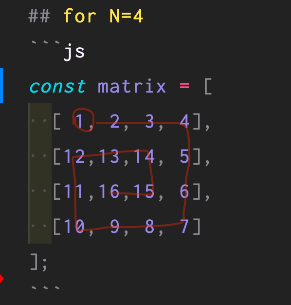

# Directions
Given an input of a positive integer N.
Fill a NxN matrix with an incremental positive number sequence as a spiral.

# examples

## for N=2
```js
const matrix = [
  [1, 2],
  [4, 3]
];
```

## for N=3
```js
const matrix = [
  [1,2,3],
  [8,9,4],
  [7,6,5]
];
```

## for N=4
```js
const matrix = [
  [ 1, 2, 3, 4],
  [12,13,14, 5],
  [11,16,15, 6],
  [10, 9, 8, 7]
];
```

An NxN matrix where the numbers increment in a spiral.

## Spiral Matrix:
If you draw a line on a spiral matrix in the ascending order of the values, you will see that a spiral is formed.



